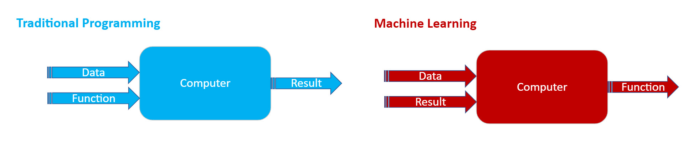
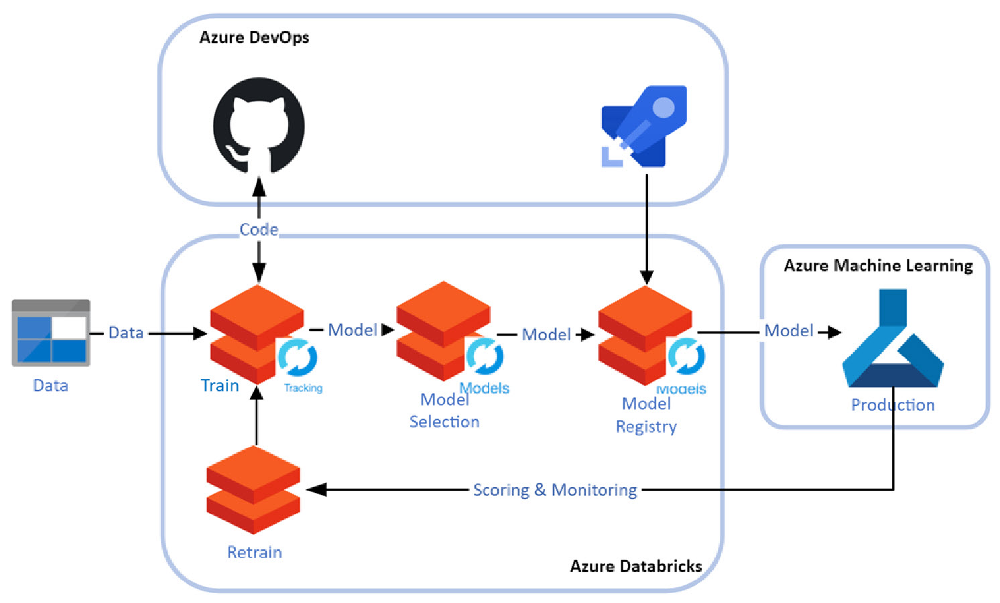

# MLOpsDemo at Microsoft Spark 3.0 (2021 July)

## Problem Statement

### In this problem, we create a machine learning model to predict KM based on miles. 

**Input:** Mile (float) 

**Output:** KM (float)

Data source: Random sampled numbers between (1, 50000) with random noise.

## ML Pipeline Architecture

